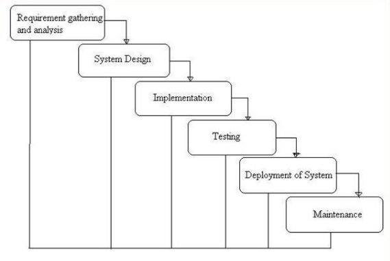
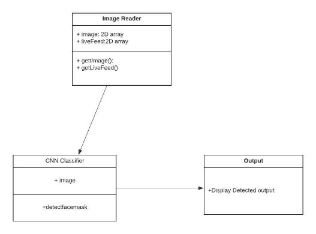
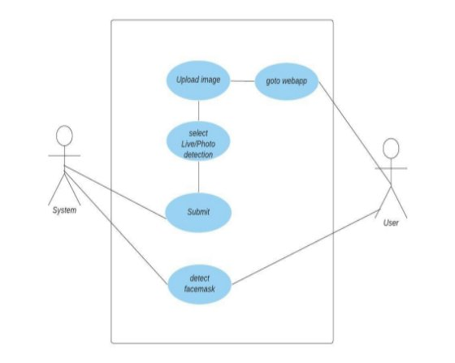
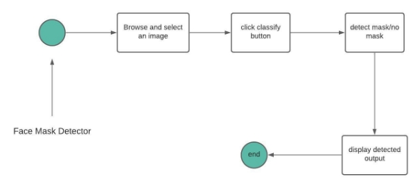
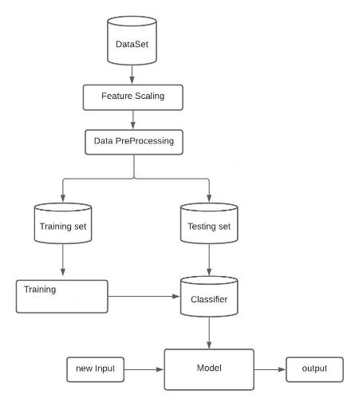
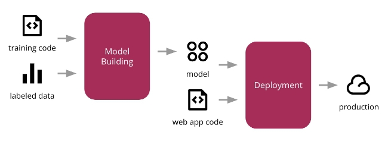
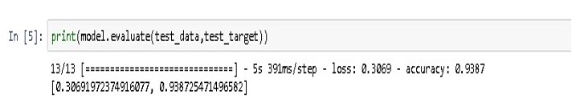
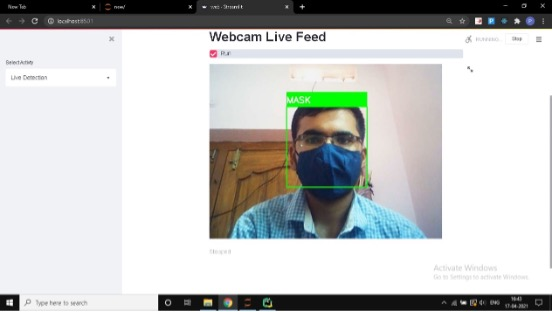
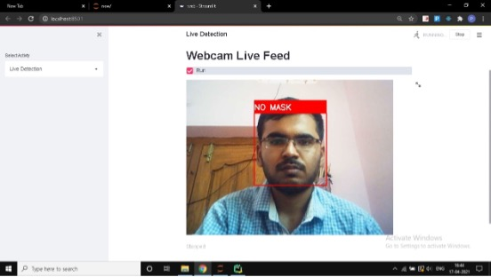

# Face Mask Detection

**Major project submitted in partial fulfillment of the requirements for the award of the degree of**

**BACHELOR OF TECHNOLOGY IN COMPUTER SCIENCE AND ENGINEERING Submitted by Perla Sai Charan Reddy**

**Under the guidance of Mrs. Koti Neha Assistant Professor DEPARTMENT OF COMPUTER SCIENCE & ENGINEERING GITAM**

1. **ABSTRACT**

The COVID-19 coronavirus pandemic is causing health crises around the world. According to the World Health Organization (WHO), wearing a face mask is an effective means of protection in public places. In most public gatherings such as shopping centers, theaters, parks, it is increasingly necessary to make sure that people in the crowd are wearing masks. Developing an artificial intelligence solution that determines whether a person is wearing a mask and letting it in will be great help for the society. In this case, a simple face mask detection system is built using deep learning techniques such as machine learning and persuasive neural network. The model is built with machine learning and OpenCV libraries often used for real-time applications. This model can also be used to develop complete software that scans each person before going to a public meeting.

2. **INTRODUCTION**

Due to the coronavirus outbreak (COVID-19), many countries have introduced new rules for wearing masks. The government has begun work on new strategies for space management, social exclusion, and access to medical staff and the public. The government has also forced hospitals and other organizations to adopt new infection prevention measures to prevent the spread of COVID-19. The transmission rate of COVID-19 is around 2.4. However, data transfer rates may vary depending on government policies and policies. As COVID-19 spreads through close contact with airborne droplets, the government has begun to apply new rules forcing people to wear masks. The purpose of wearing a mask is to reduce the spread of infection.

COVID-19 presents a major public and economic health problem today because it has a devastating impact on the quality of life of humans today and contributes to acute respiratory infections, deaths, and financial crises worldwide. According to reports, COVID-19 has infected more than 6 million people in more than 180 countries with a 3% mortality rate. COVID-19 spreads easily through tight spaces and close contact. Many governments face significant challenges and risks in protecting people from coronavirus. Face mask detection is at the heart of facial recognition applications such as object detection, as many countries have laws requiring people to wear masks in public places. To combat the COVID-19 pandemic, governments in public places, especially in densely populated areas, need leadership and vigilance to enforce the worm law. This can be applied through the integration of surveillance systems and artificial intelligence models.

Face mask detection is both a detection problem and a classification problem because you first need to find a person's face in a digital image and then decide whether a mask is needed or not. The main goal of this study is to identify and find medical face masks in images. In this article, the masked face is a major focus of research aimed at reducing the spread of the coronavirus, especially COVID-19. All object detection methods are divided into machine learning and deep learning. It uses a convincing neural network due to its high speed and performance.

3. **LITERATURE SURVEY**

Much literature has been written on the perception of sensory activity. Bulling et al. [6] gives an overview of the problem and highlights the possibilities and limitations of distribution models based on static and shallow functions. Alsheikh et al. [2] presents the first model-based deep learning approach for HAR. It generates an inertial signal spectrogram image and transmits the actual image to a convincing neural network. With this method, you don't need to convert the signal to a format suitable for CNN, but creating a spectrometer replaces only the function extraction function and adds initial overhead to network training.

No, Jen. It uses the raw acceleration signal as input to the convulsive network and applies a one- dimensional convulsion to all signal components. This technique can lead to loss of spatial conditions between different components on the same sensor. It mainly focuses on the amount of data widely available from embedded sensors (e.g. smartphones) or portable handheld sensors. A similar method is provided.

Yangetal. In their work they usually use the same amount of data as available, but use two- dimensional interference to represent the channels with motion signals. This custom CNN activity recognition app is further enhanced by Haetal with a powerful multi-channel network that distributes daily activities across popular extreme motion datasets using acceleration and angular velocity signals. The distribution tasks they perform are individual, so the signals received from each participant are used to train individual models for training. One of the missing pieces in each of the detailed training models described earlier is the comparison of the classification performance of individual inspectors or groups. This article aims to solve your activity identification problem correctly and then implement a deep CNN that allows you to compare the results obtained with various sensor combinations. We also pay particular attention to the set of exercises included in Otago's training program. To the best of our knowledge, this group of documents has never been investigated for perceptual activity before.

4. **PROBLEM IDENTIFICATION AND OBJECTIVES**
 **INTRODUCTION**

Problem identification is part of a scientific approach because it is the first step in a systematic process of identifying, evaluating, and exploring possible solutions.

 **EXISTING SYSTEM**

Existing methods using support Artificial Neural Networks and other machine learning models .

  **Drawbacks of existing system**

Classification is slower and costlier with respect to time and memory. It is not suitable for high dimensionality data like images.

**PROPOSED SYSTEM**

By using Convolutional neural network we can detect the face mask. Tenserflow, numpy, pandas,OpenCv these are the some of the packages for understanding purpose of machine learning. By Using CNN we can built model with less memory and high accuracy which helps in detecting face mask and reduce risk of COVD-19.

 **Advantages**

Fast, less time and memory

 **STRUCTURE OF THE PROJECT**

 Fig: 4.1 Project SDLC

 **Accumulation and analysis of requirements**

This is the first and most obvious step in any project, because holidays are the Sabbath for gathering the necessary information. We followed the IEEE journal, collected a lot of IEEE-related documents, and eventually selected it from a website that installed a document called "Review Solo." . The importance of the content was noted and noted, and in the analysis phase, we reviewed articles, reviewed the literature for some articles, and gathered all the details about the project.

 **System design**

There are three types of system design: GUI design, UML design with simplified project design with different actors, use case with use case diagram, project flow with sequence, and class diagram embedding information for project with methods to use. When you join our project in a project, UML is used that way. Module of the project

 **Implementation**

Implementation is the stage where we strive to provide work results to the work done in the design phase, and most of the code in the business logic is implemented as a major part of the project.

 **Testing**

Testing is an operating condition that verifies that a system is operating properly and efficiently before it is actually used. The following is a description of the testing strategy implemented during the testing period.

**System Deployment and Maintenance**

When the project is complete, I will start using my client system in the real world on the Sabbath because I only used all the Windows software that the university needed.Project execution is a one- time process.

 **OBJECTIVES**

The goal of the project is to develop a machine learning model which can detect people faces with or without mask and deploy it in website. Reduce the time delay and effort caused for checking weather people wore mask or not in public places.

 **OUTCOMES**

The images data is collected from Github repository. With this data will be going to train the Machine learning Model. Then Deploy in the website. When the new person data is entered in the website we can detect weather person has wore face mask or not.

 **APPLICATIONS**

This strategy used for Face mask detection, facial expressions recognition.

 **SYSTEM METHODOLOGY AND DESIGN**

 **UML DIAGRAMS**

System specifications, operating environment, system and subsystem architecture, file and database design, input formats, output circuits, human machine interfaces, comprehensive design, processing logic, and external interfaces are all described in the system design document.

1. **Class Diagram:**

A Unified Modeling Language is used in software engineering (UML). A class diagram is a static structural diagram that shows system classes, their properties, behaviours, and relationships between classes to explain the structure of a system.

Fig 5.1: Class Diagram

2. **Use Case Diagram:**

A use case diagram represents a user's interaction with a system and is a use case specification. Usage diagrams can show different types of users of the system and the different ways they interact with the system. This type of chart is often used with text use cases and other chart types.

Fig 5.2: Usecase diagram

3. **sequence diagram:**

Sequence diagrams are a sort of moveion diagram that shows however and in what order processes interact with one another. the subsequent is that the structure of the message sequence diagram. Sequence diagrams show the interactions between objects organized in time. Shows the objects and categories that structure the script and a collection of messages changed between the objects needed to perform the functions of the script. Sequence diagrams ar sometimes related to use cases within the logical drawing of the system being designed. Sequence diagrams are referred to as event diagrams, event situations, and time diagrams.

Training datset Image Image upload Detect

: User

1 : CNN()

2 : Click()

3 : Upload()

4 : Fake Detection()

Fig 5.3:Sequence diagram

4. **State Chart Diagram**

The movement of control from one state to the next is depicted in a state chart diagram. When an entity exists and an event occurs, state is described as the state that changes. A state map's main aim is to model an object's lifetime from development to completion.

Fig 5.4:State chart diagram

5. **Activity Diagram:**

Another essential diagram in UML is the operational diagram, which depicts the system's complex aspects. It's essentially a flowchart that depicts the transition from one operation to the next. Tasks are also known as machine tasks.

Fig 5.5:Activity diagram

6. **Data Flow Diagram:**

DFD is a model for building and analyzing information processes. DFD shows low level information in the process due to its input and output DFD is also known as the process model. DFD represents a business or technical process that supports data stored externally as well as data transferred from a process to another end result.

Fig 5.6:Data flow Diagram

7. **Architecture Of Project**

The machine learning architecture defines the various layers that make up the machine learning cycle and includes the basic steps to transform raw data into a set of training data to enable system- based decision making.

Fig 5.7:Architecture diagram

**6 OVERVIEW OF TECHNOLOGIES**

1. **INTRODUCTION OF TECHNOLOGIES USED**
1. **Python**

Python is a very powerful programming language used for a variety of applications. Over time, a large community centered around this open source language has created many tools that work effectively with Python. Several tools have been created specifically for computer science in recent years. As a result, analyzing data with Python is easier than ever. Python is a programming language that helps you to work more easily and efficiently with programmes. Python is divided into two versions: Python 2 and Python 3.

‘The two are diametrically opposed. Python is a programming language that can be used in a variety of ways. Many functions allow functional and side-oriented programming, and object-oriented and structured programming are completely supported’.[2].

Many other designs, including contract design and logical programming, are supported by add-ons. Python uses ‘a combination of’ dynamic typing ‘and a garbage collector’ to define links for reference accounts and memory management. It also has a variable mode and ‘dynamic name resolution (late binding) that binds names’ when driving. Python design provides ‘some support for functional programming in the Lisp tradition’. It has filtering, display and collapsing functions. The last set of vocabulary, dictionary, and generator expressions.

The standard library contains two modules (IT tools and functional tools) that operate functional tools borrowed from Haskell and Standard ML. Python is designed as an easy-to-read language. The format is not visually cluttered and ‘often uses English keywords, while other languages use punctuation. Unlike many other languages’[2], you don't use curly braces to separate blocks, and the semicolon after the statement is optional. There are fewer syntax ‘exceptions and special cases than C or Pascal’[2].

2. **AI ML & Deep Learning**

In this age, Artificial intelligence(AI), Machine learning(ML), Deep learning(DL), and data science are all buzzwords. The distinction between them is now more important than ever. While these words are similar, there are distinctions between them; see the image below for a visual representation.

Fig 6.1 AI ML & deep Learning

**Artificial Intelligence**

AI allows machines to think, which means they will be able to make decisions without the need for human interference. It's a wide field of computer science that simulates human intelligence in computers. So it's not about training a computer to drive a car by obeying traffic signals; it's also when the computer learns to show human-like signs of road rage.

**Machine Learning**

Machine Learning is a subset of artificial Intelligence that employs mathematical learning algorithms to create systems that can learn and develop on their own without being specifically programmed.

Supervised, Unsupervised, and Reinforcement learning are the three types of machine learning algorithms.

**Supervised Learning**

In supervised learning, you already know what a set of data will look like, with an idea of the relationship between the inputs and the outputs.

**Unsupervised Learning**

This allows you to deal with problems with little or no idea how the results will appear. You can collect data structures that don't need to know the effect of the variable. You can achieve this structure by grouping data based on the relationship between variables in the data.

**Reinforcement Learning**

Reinforcement learning is taking appropriate steps to maximize rewards in a given situation. It is used by various programs and machines to find the optimal motion or path for a given situation.

Reinforcement learning differs from supervised learning in that supervised learning has a solution key in the training data, so the model is trained with the correct solution. You have done this. Without a training data set, he has to learn from his own experience.

**Deep Learning**

Deep learning, which mimics the way the human brain processes data and generates patterns for use in decision making, is the function of artificial intelligence (AI). Deep learning is an artificial intelligence branch of machine learning that uses networks to monitor learning based on unstructured or unstructured data. Deep neural networks or deep neural learning are other terms for the same thing.

Deep learning is a machine learning methodology that is based on how the human brain filters information and learns from examples. It aids a computer model's ability to process input data across layers in order to predict and classify data. Deep learning is often used in applications that people do because it handles knowledge in the same way that a human brain does. It's the technology that allows self-driving cars to identify a stop sign and differentiate between a pedestrian and a lamp post. Deep neural networks are the name given to the majority of deep learning approaches that use neural network architectures.

Deep Learning is a multi-neural network architecture that contains a large number of parameters and layers that is designed to simulate the human brain.

3. **NumPy**

NumPy is an open source Python digital library. It contains multidimensional matrices and matrix data structures. It Can be used to perform several mathematical operations on matrices Such as trigonometric, statistical and algebraic procedures. Therefore, the library contains a large number of math, algebra and transformation functions. NumPy is an extension of Numeric and Numarray. It also includes a random number generator. It is a cover for C-based libraries.

4. **Pandas**

In computer programming, pandor is a set of data processing and analysis programmes written in the Python programming language. It offers data structures and operations for handling numerical tables and time series in particular. It's open-source software distributed under the BSD three-part licence.

Key Features of Pandas

- Fast and efficient data frames using standard indexing and single indexing.
- Tools to transfer data to memory objects of multiple file types.
- Data reconciliation and complex handling of missing data.
- Redraw and rotate a set of dates. Split, index, and sublimate large label-based data sets.
- You can delete or insert columns in the data structure.
- Grouped by data for aggregation and transformation.
- High-performance data is pooled and merged. Time series function.
5. **Scikit-learn**

Scikit-learn i.e Sklearn is python library. It is one of the Python's most useful and popular machine learning library. It provides a powerful set of machine learning and statistical modeling tools, including classification, regression, cluster, and dimensionality reduction through a Python consistency interface. Written primarily in Python, this library is based on the libraries like NumPy, SciPy and Matplotlib.

6. **[Streamlit**](https://streamlit.io/)**

[Streamlit](https://streamlit.io/) is an open source Python library.That makes easy to create and publish flexible web applications for machine learning and computer science. Build and use powerful computer applications in minutes.

7. **REQUIREMENTS**

 General description**

System Specifications Specifications are standard data sets that summarize system requirements. Business analysts, also known as systems analysts, assess the business needs of customers and stakeholders to identify and recommend solutions to business problems.• Company specifications define what needs to be delivered or completed in order to have value.

- Product specifications define a system's or a product's characteristics
- The aim of a feasibility study is to determine whether adding new modules and debugging an existing device is technically, operationally, and economically feasible. If there are limitless resources and time, every system is feasible. There are some elements of the preliminary investigation's feasibility report.

**Hardware requirements:**

Processer : Min i3

Ram : min 4 GB

Hard Disk : min 200 GB

**Software requirements:**

Operating System OS :  Windows

Tools/Technologies :   streamlit, opencv, numpy, pandas 

IDE :  PyCham/Jupiter

UML :  Star UML

Programming language:  Python

3. **DATASET**

The dataset contains images of human faces with mask and without mask.The dataset is taken from the Github Repository.

4. **MODULES**

1\.Collection of Data 2. Pre-processingdata 3.Training and Testing 4.Modeling 5.Predicting

1. **Data Preprocessing**

The dataset we use contains images of different colors, sizes and orientations. So you need to convert all images to gray scale images. This is because you need to make sure that the color doesn't have to be an important point for mask detection. All images must be the same size (100x100) before placing them in the neural network.

2. **Training The CNN**

There are two convincing levels (two Convo2D 100 @ 3x3). First you need to load the dataset from the preprocessed data. Then you need to create an attractive architecture. I added model.add(Dropout(0.5)) to remove the override. There are two categories (masking and unmarking) so you can use binary\_crossentropy. Start the first 20 workouts with mock checkpoints.

3. **Detecting Mask from images**

First, you have to load the model that we created. Then we set the camera we want as the default.

5. **Proposed System**

ConvNet/CNN (Convolutional Nuclear Network) is a deep learning algorithm that can take an input image, assign weights ‘learnable weights and biases to different aspects/objects’ of the image and distinguish them from each other. The preprocessing required for ‘ConvNet is much lower compared to other’ allocation algorithms. Raw method filters are created manually after proper training, but ConvNet can learn these filters/features.

**Types of layers:**

1. Input Layer
1. Convolution Layer
1. Activation Layer
1. Poolling Layer
1. Fully-Connected Layer

Fig 6.2 CNN

**Input Layer:** This layer contains raw image input data with a width of n, a height of m, and a depth of 3.

**Conviction Layer**: By calculating the point yield between all filters and discs in the image, this layer calculates the output volume. If you use a total of 12 filters for this layer, you'll end up with a 32 x 32 x 12 output volume.

**Activation function layer**: The performance of the prison layer is subjected to an elemental activation mechanism in this layer. RELU: max (0, x), Sigmoid: 1 / (1 + e -x), Tanh, Reak Leaky, and so on are some typical activation functions.

7. **IMPLEMENTATION**
 
 Pre-Processing

‘’import cv2 as opencv

import os as op’’

import numpy as numpy

fullpath=r'C:\Users\charan\new\data'

category=os.listdir(fullpath)

y=[j for j in range(len(category))]

y\_dt=dict(zip(category,y))

print(y\_dt)

imgsize=100

X=[]

Y=[]

for i in category:

folderpath=op.path.join(fullpath,i)

imgnames=op.listdir(folderpath)

for imgname in imgnames:

imgpath=op.path.join(folderpath,imgname) faceimg=opencv.imread(imgpath)

if (type(faceimg) is numpy.ndarray):

try:

grayimg=opencv.cvtColor(faceimg,opencv.COLOR\_BGR2GRAY) resizedimg=opencv.resize(grayimg,(img\_size,img\_size)) data.append(resizedimg)

Y.append(y\_dt[i])

except Exception as exe:

print('Exception is :',exe)

import numpy as numpy

X=numpy.array(X)/255 X=numpy.reshape(X,(X.shape[0],imgsize,imgsize,1)) Y=np.array(Y)

from keras.utils import np\_utils new\_target=np\_utils.to\_categorical(target) numpy.save('X',X)

numpy.save('Y',Y)

2. **Trainig**

import numpy as numpy

#loading the save numpy arrays in the previous code X=numpy .load('X’.npy')

y=numpy .load('Y’ .npy')

‘’from keras.models import Sequential

from keras.layers import Dense,Activation,Flatten,Dropout from keras.layers import Conv2D,MaxPooling2D

from keras.callbacks import ModelCheckpoint’’ Model1=sequential() ‘‘Model1.add(conv2D(200,(3,3),input\_shape=data.shape[1:])) Model1.add(activation('relu')) Model1.add(maxpooling2D(pool\_size=(2,2)))’’

‘Model1.add(conv2D(100,(3,3)))

Model1.add(activation('relu'))

Model1.add(maxpooling2D(pool\_size=(2,2)))

Model1.add(flatten())’

‘‘Model1.add(dropout(0.5))

Model1.add(dense(50,activation='relu'))’’

#Final layer

‘’Model1.add(dense(2,activation='softmax')) Mode1l.compile(loss='categorical\_crossentropy',optimizer='adam',metrics=['accuracy'])’’ from sklearn.model\_selection import train\_test\_split X\_traindata,X\_testdata,y\_traindata,y\_testdata=train\_test\_split(X,y,test\_size=0.2)

‘checkpoint=ModelCheckpoint('Model1{epoch:03d}.model',monitor='val\_loss',verbose=0,save\_bes t\_only=True,mode='auto')’

‘History1=Model1.fit(X\_traindata,y\_traindata,epochs=20,callbacks=[checkpoint],validation\_split=0. 2)’

print(Model1.evaluate(test\_data,test\_target))

**5.1.3 Detection**

import streamlit as st

from keras.models import loadmodel import opencv

import numpy as numpy

from PIL import Image

Model = loadmodel('Mod-008.model')

faceclsfr = opencv.CascadeClassifier('haarcasca.xml') labels = {1: 'MASK', 0: 'NO MASK'}

color = {0: (0, 0, 255), 1: (0, 255, 0)}

def detect\_facemask(our\_image):

labels={1:'MASK',0:'NO MASK'}

faceimg = numpy.array(our\_image.convert('RGB'))

if (type(faceimg) is np.ndarray):

grayimg=opencv.cvtColor(faceimg,opencv.color\_bgr2gray) faceimg=faceclsfr.detect\_multi\_scale(grayimg,1.03,5)

for (xi,yi,wi,hi) in faceimg:

faceimg=grayimg[yi:yi+wi,xi:xi+wi] resizedimg=opencv.resize(faceimg,(200,200)) normalizedimg=resizedimg/255 reshapedimg=numpy.reshape(normalizedimg,(1,200,200,1)) rest=Model.predict(reshapedimg) l=np.argmax(res,axis=1)[0]

#st.text(label)

return (labels\_dict[l])

def main():

st.title("Face Detection App")

st.text("Build with Streamlit and OpenCV")

activities = ["Photo Detection","Live Detection","About"] choice = st.sidebar.selectbox("Select Activty", activities) if choice == 'Photo Detection':

st.subheader("Face Mask Detection")

image\_file = st.file\_uploader("Upload Image", type=['jpg', 'png', 'jpeg'])

if imagefile is not none:

our\_image = Image.open(image\_file) st.text("Original Image") st.image(our\_image)

if st.button('Classify'):

result=detect\_facemask(our\_image) st.success(result)

elif choice == 'Live Detection':

st.subheader("Live Detection") st.title("Webcam Live Feed")

run = st.checkbox('Run')

frameST = st.empty() #FRAME\_WINDOW = st.image([]) camera = opencv.VideoCapture(1)

while run:

\_, image = camera.read()

grayimg = opencv.cvtColor(image , opencv.colorbgr2gray) facesall = faceclsfr.detect\_mult\_iscale(grayimg, 1.03, 5) for (xi, yi, wi, hi) in facesall:

faceimg = grayimg[yi:yi + wi, xi:xi + wi]

resizedimg = cv2.resize(faceimg, (200, 200))

normalizedimg = resizedimg/ 255

reshapeimg = numpy.reshape(normalizedimg, (1, 200, 200, 1))

res = Model.predict(reshapeimg)

l = numpy.argmax(res,, axis=1)[0]

opencv.rectangle(image , (xi, yi), (xi + wi, yi + hi), color[label], 2) opencv.rectangle(image , (xi, yi - 40), (xi + wi, yi), color[label], -1)

opencv.putText(image ,labels[label],(xi,yi-10), opencv.’FONTHERSHEYSIMPLEX’, 0.8,

(255, 255, 255), 2)

frameST.image(image, channels="BGR")

else:

st.write('Stopped')

elif choice == 'About':

st.subheader("About Face Detection App") st.markdown("Built with Streamlit by ") st.text("Sai Charan\nAravind\nAlekhya\nKoushik") st.success("")

if \_\_name\_\_ == '\_\_main\_\_':

main()

**TESTING**

Accuracy -93%

Fig 8.10 Web App

Fig 8.11 facemask detection from photo

Fig 8.12 face detection without mask from photo

Fig 8.13 Live Face with mask detection

Fig 8.14 Live Face without mask detection

9. **CONCLUSIONS AND FUTURE SCOPE**

Face-based identification can be broadly divided into two application scenarios: an unmanaged application environment and a managed application environment. The first is primarily concerned with public surveillance situations where surface launch distance, visibility, posture, occlusion and lighting are uncertain. In this case, the accuracy of face recognition is relatively low. Also, wearing a face mask reduces the accuracy even further. However, there are many managed application scenarios such as checking the presence of the workplace up to the camera, checking the security of the train station, and the cost of scanning the surface. This makes it easy to get a high-quality frontal image, so the task of identifying the masked face is no longer difficult.

10. **REFERENCES**

[1]https://www.schoolsolver.com/attachments/attachment/121698/ 
[2]https://en.m.wikipedia.org/wiki/Python\_(programming\_language) 
[3]https://towardsdatascience.com/understanding-the-difference-between-ai-ml-and-dl- cceb63252a6c 
[4]http://docplayer.net/49061159-Beginning-software-engineering.html 
[5]https://www.slideshare.net/samaram20/restaurant-billing-application/16
[6]https://zhuanlan.zhihu.com/p/107719641?utm source=com.yinxiang
[7]https://tzutalin.github.io/labelImg/
[8]https://www.coursehero.com/file/77347106/L1-Introductionpdf/
[9]G. B. Huang, M. Mattar, T. Berg, and E. Learned-Miller, “Labeled faces in the wild: A database for studying face recognition in unconstrained environments”, Technical report, 2007. 
[10]https://www.coursehero.com/file/77347106/L1-Introductionpdf/
[11]https://www.geeksforgeeks.org/introduction-convolution-neural-network/
[12]https://www.schoolsolver.com/attachments/attachment/121698/

