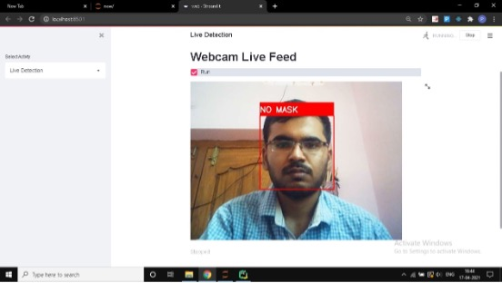
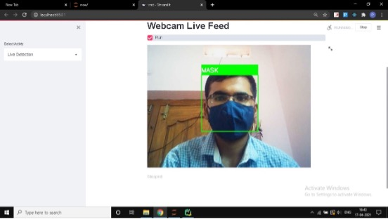

# Face Mask Detection


[](https://www.python.org/)
[](https://streamlit.io/)
[](LICENSE)

---

## Table of Contents
1. [Overview](#overview)
2. [Features](#features)
3. [Technologies Used](#technologies-used)
4. [Installation](#installation)
5. [Usage](#usage)
6. [Results](#results)
7. [Contributors](#contributors)
8. [License](#license)

---

## Overview
The Face Mask Detection project is an AI-powered solution to detect whether a person is wearing a face mask. Built using deep learning techniques, this project aims to assist in enforcing mask mandates in public spaces to combat the spread of COVID-19.

---

## Features
- Real-time face mask detection using OpenCV and TensorFlow.
- Supports both photo and live webcam detection.
- High accuracy (93%) in detecting masks.
- Easy-to-use web interface built with Streamlit.

---

## Technologies Used
- **Python**: Programming language.
- **OpenCV**: For image processing.
- **TensorFlow/Keras**: For building and training the deep learning model.
- **Streamlit**: For creating the web application.

---

## Installation
1. Clone the repository:
   ```bash
   git clone https://github.com/your-username/FaceMaskDetection.git
   cd FaceMaskDetection
   ```
2. Install dependencies:
   ```bash
   pip install -r requirements.txt
   ```
3. Run the setup script:
   ```bash
   sh setup.sh
   ```

---

## Usage
1. Start the web application:
   ```bash
   streamlit run web.py
   ```
2. Choose between "Photo Detection" or "Live Detection" on the sidebar.
3. Upload an image or enable your webcam to detect masks.

---

## Results
### Accuracy: 93%

#### Example Outputs:
- **Face with Mask**:
  
- **Face without Mask**:
  

---

## Contributors
- **Sai Charan**
- **Aravind**
- **Alekhya**
- **Koushik**

---

## License
This project is licensed under the MIT License. See the [LICENSE](LICENSE) file for details.


